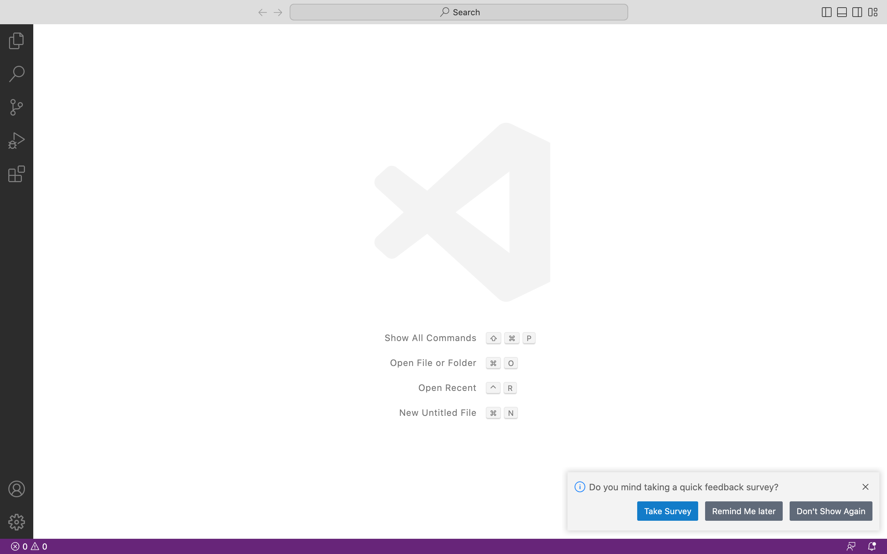
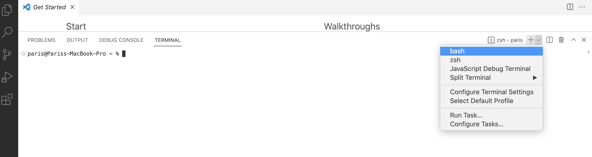
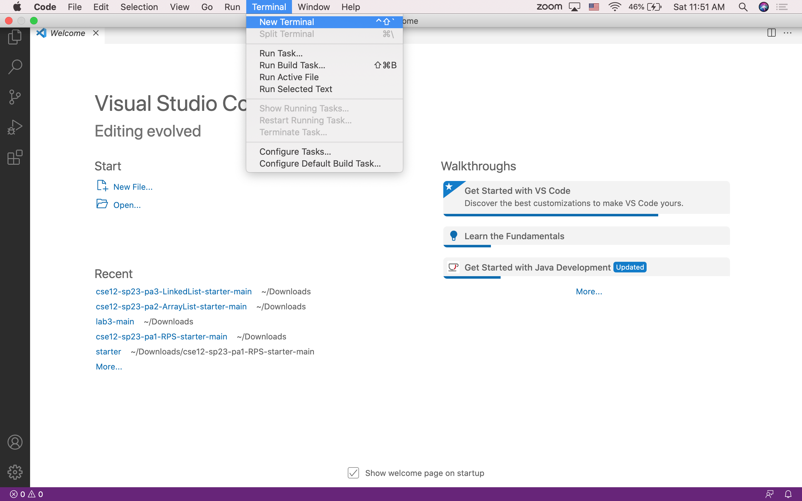
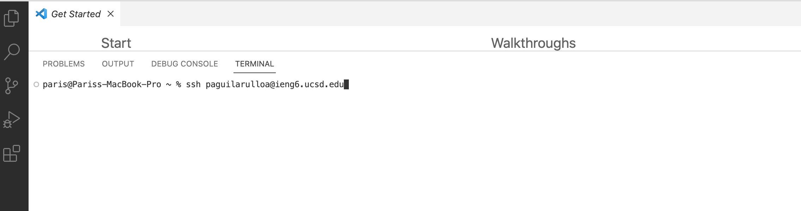
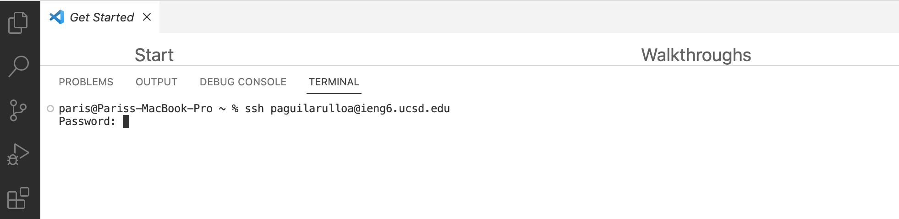
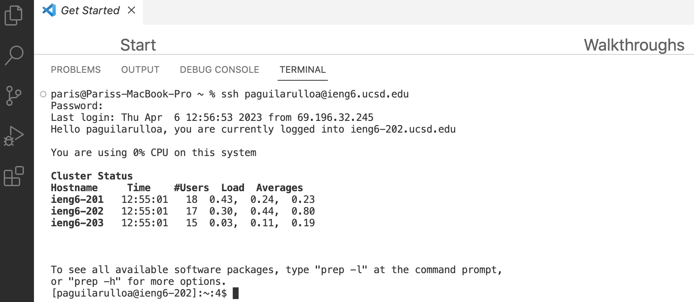
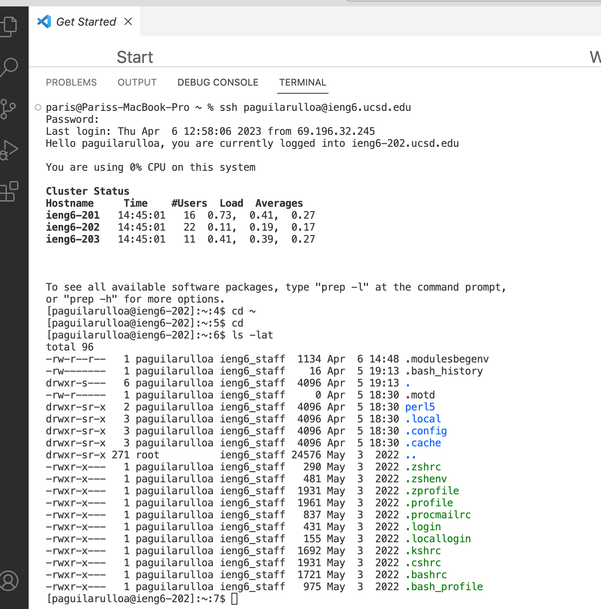

Welcome! This is a tutorial in order to log into a course-specific account on ieng6.

First thing is First! The Set Up:
Visual Studio Code is a streamlined code editor (app,software) with support for development 
operations likedebugging, task running, and version control. 

# Part 1

**Setting up Visual Studio**

Visual Studio code will be our main place to be in order to continue working with an account of ieng6.

>Installing VS(Visual Code):
>**if not have installed Please Follow steps below:**
>
>1.Go to the Visual Studio Code Installation Website <https://code.visualstudio.com>\
>2.Follow Instructions provided in order to download in your personal computer or whichever device youll be using \
>3.Once installed youll be able to open it and see something similar to this picture:
>
>

**congratulations!!! You have successfully insalled VS**

# Part 2

**Remotely Connecting with ieng6 account!**

**caution !!**
---
>If you are setting this up on a Windows Please do the following:
>**Go to this link <https://gitforwindows.org> and download the following app**
>
>>Once downloaded youll will now be going to Visual Studio Code and open a **New Terminal**
>>
>
>
>>After youll have to change the setting to bash like this:
>>
>

---

# **Setting up ieng6 on VS**

Open a **New Terminal**

>Steps in Opening a Terminal:
>1) Clicking on one of your computer commands at the top titled as `Terminal` and continue in that file by clicking on `New Terminal` just like the following image below.
>
>2) Or you can just do a quick shortcut and use the key board command of: **Ctrl+Shift+**

**If a question pops up in te terminal it is valid to say YES to anything the software is asking in order to have a smooth installation**

* In order to set up ur ieng6 account we will begin by typing `ssh` first then following your _AD username_ 

For example:
>My AD username is 'paguilarulloa' so it would look something like this 
>* In order to go directly to the account youll have to type '@ieng6.ucsd.edu' right after your typed the username. 
>

* Next youll click enter, which will result with the terminal asking for a _PassWord_\
Once you type your AD password it will not show anything in the terminal this is for secuirty purposes (so no one can see you type the password!!) 

* If the password was corretly written (yes it took me more than once to type mine correctly lol)
>Something similar as my Visual below will show up !
>

**And you have now successfully completed the set up for an account of ieng6 !!!**\
**congratulations Heres a Trophy for your Completion!**
>

# Part 3
**Trying Some Commands**

>In order to get a basic understanding in using ieng6 you can try the following commands
>>1) cd ~
>>2) cd
>>3) ls -lat
>>4) ls -a
>>5) cp /home/linux/ieng6/cs15lsp23/public/hello.txt ~/
>>6) cat /home/linux/ieng6/cs15lsp23/public/hello.txt

For example in my terminal the command 'ls -lat' executed this:

Try out these fun commands and see what you can encounter !!

_FUN FACT:_

Typing the following once you are ready to leave the terminal it can log you out successfully and quickly

* Ctrl-D
* Run the command exit

---

**Thank you for participating and taking the time to see my Tutorial !**

hope this helps !

