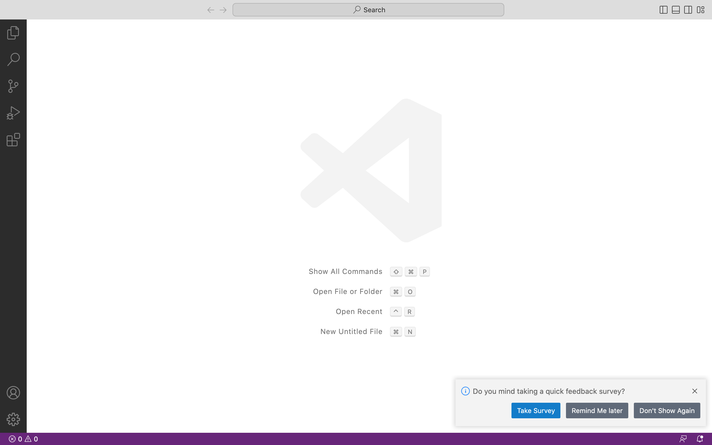
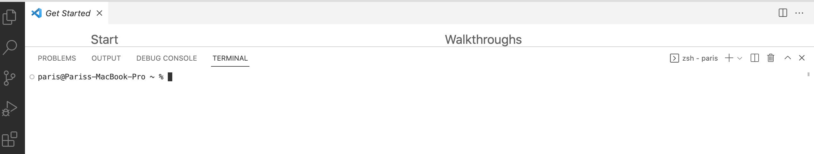
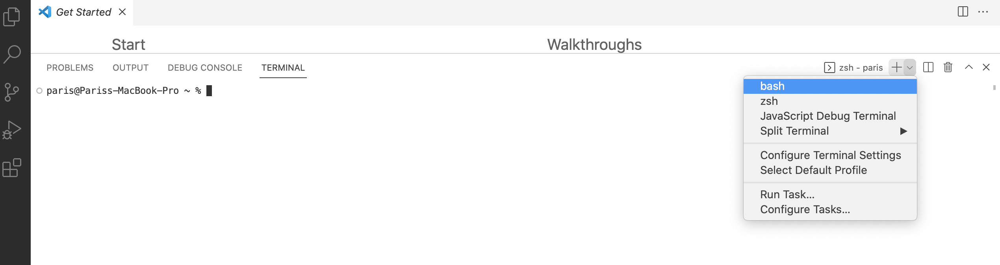
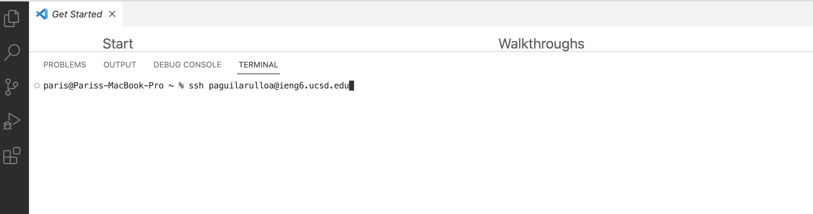
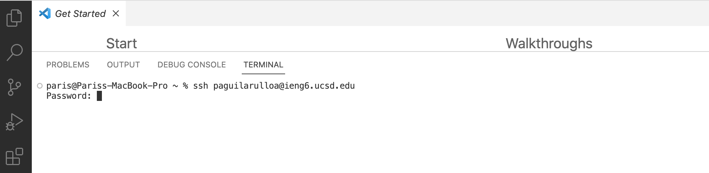
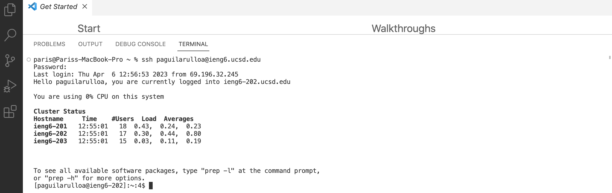

Welcome! This is a tutorial in order to log into a course-specific account on ieng6.

First thing is First! The Set Up:\
Visual Studio Code is a streamlined code editor (app,software) with support for development 
operations likedebugging, task running, and version control. 

## Part 1

**Setting up Visual Studio**

Visual Studio code will be our main place to be in order to continue working with an account of ieng6.

>Installing VS(Visual Code):\
>**if not have installed Please Follow steps below:**\
>
>1.Go to the Visual Studio Code Installation Website\
>2.Follow Instructions provided in order to download in your personal computer or whichever device youll be using \
>3.Once installed youll be able to open it and see something similar to this picture:\
>
>

**Congradulation!!! You have successfully insalled VS**

## Part 2

**Remotely Connecting with ieng6 account!**

**caution !!**
---
>If you are setting this up on a Windows Please do the following:\
>**Go to this link <https://gitforwindows.org> and download the following app\**
>
>>Once downloaded youll will now be going to Visual Studio Code and open a **New Terminal**
>>
>
>
>>After youll have to change the setting to bash like this:
>>
>

---

# **Setting up ieng6 on VS**

Open a **New Terminal**

* In order to set up ur ieng6 account we will begin by typing _ssh_ first then following your _AD username_ 

For example:
>My AD username is 'paguilarulloa' so it would look something like this

* Next youll click enter,which will result with the terminal asking for a _PassWord_\
Once you type your AD password it will not show anything in the terminal this is for secuirty purposes (so no one can see you type the password!!) 

* If the password was corretly written (yes it took me more than once to type mine correctly lol)
>Something similar as my Visual below will show up !
>

# **And you have now successfully completed the set up for an account of ieng6 !!!**
## Congradulations Heres a Trophy for your Completion!

